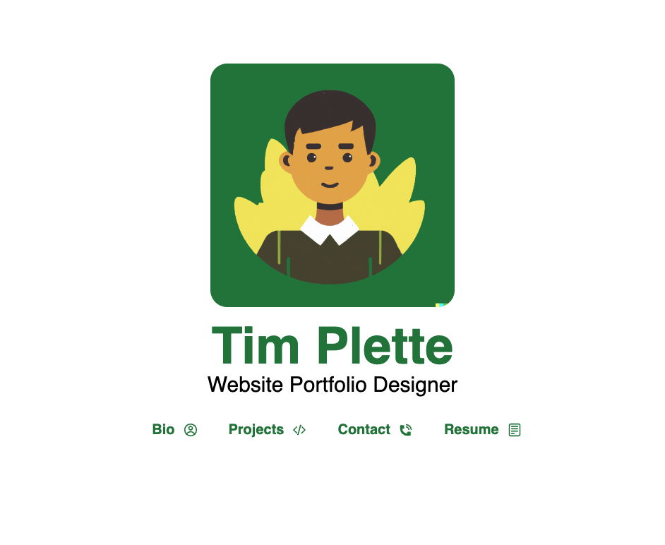
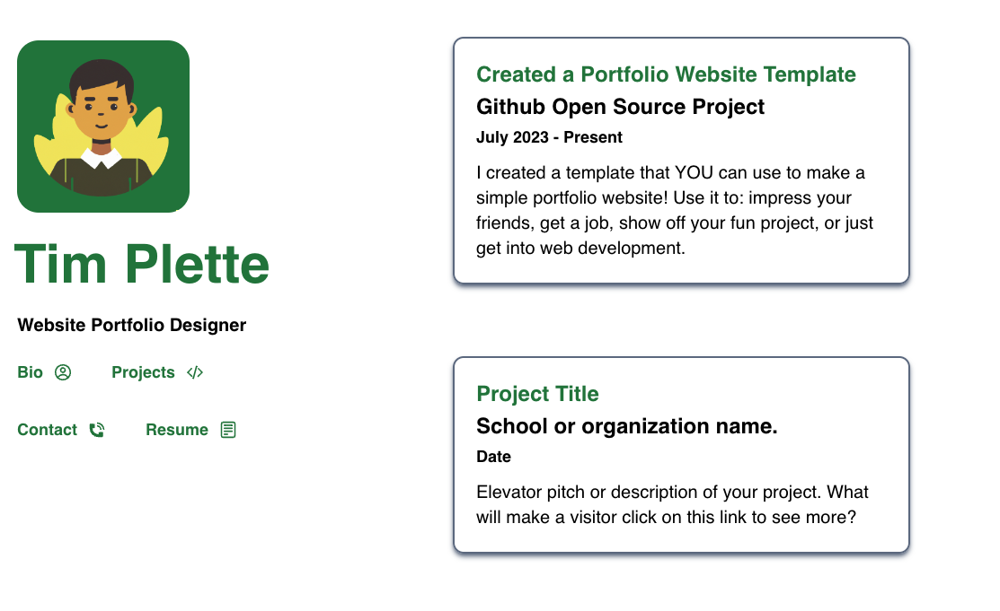

<p align="center">
  <a href="https://josh-beck.github.io/Portfolio-Website-Template/">
    
  </a>

  <a href="https://josh-beck.github.io/Portfolio-Website-Template/bio/">
    
  </a>

</p>

<h1 align="center">
    <a href="https://josh-beck.github.io/Portfolio-Website-Template/">
        Portfolio Website Template
    </a>
</h1>

<div align="center">

<a href="">
    </img>
</a>

<a href="">
    </img>
</a>

</div>

----

## About

Do you want a cool web portfolio? How about one that is easy to modify, with minimal coding knowledge necessary? Then this is the template for you! Follow the steps below to set up and deploy **your own website!**


## Development Environment

Local development is the process by which you write your website and quickly review it, all on your local computer, without hosting anything on the internet. It's not technically necessary to run your code locally. You can modify the content of this template on Github in your browser, then use the [Hosting and Deploying](#hosting-and-deploying) section below to see the results of your changes. However, this will take longer to view your changes, and if you change more than just text, you may find it easier to test everything locally beforehand. Therefore, outlined below are the steps to run this website on your computer and quickly see your changes in browser.

### Install NPM & Node

You'll need npm and node installed in order to run this website locally. You can use articles like ["How to Install NPM and Node JS on Mac and Windows"](https://positiwise.com/blog/how-to-install-npm-and-node-js-on-mac-and-windows) to install the following tools: `npm` and `node`. Once these are installed, perform the following commands in the local cmd directory of the website:

1. `npm install` - This will install the necessary dependencies for the website to run locally.
2. `npm run dev` - This will start the website, hosting it on localhost port 8000.

Go to your browser and enter `http://localhost:8000`, which will pull up the website, now running locally on your computer. Whenever you save changes to website files, as long as this is running, they should update in the browser. Consider restarting it every so often as you develop, to ensure you don't have caching issues.
 

## Customization

Outlined in each section below are the steps necessary to customize the website to your preferences. Some are easy, like [color changes](#color-scheme) or [text content](#markdown-content) written in markdown. Others may required a bit more work. At the end of the day, all of it is for you to explore and find what works best for you!


### Color Scheme

The template is set up so you only have to change a few fields to change the color palette to your liking. In the [global.css](/src/content/css/global.css) file, you'll find the all the styling for the website, including the primary and secondary color options. 


#### Primary Color

I recommend changing both primary colors to the same thing, one that closely matches your headshot photo's primary color. In the example `green-700` was used to closely match the background of the cartoon headshot. *(Note: Leave the `text-` and `bg-` in the color selection. Only modify the name of the color and the "amount" of the color, like changing `green-700` to `red-500`.)*


#### Secondary Color

For the secondary color, I have found that selecting a color 200 points darker than the primary color works well. It is used mostly for hyperlinks, which will become highlighted in the primary color when hovered over. However, you can experiment as see what works best for you!

*For more information about the color schemes, check out this link to the [Tailwind Colors Documentation](https://tailwindcss.com/docs/customizing-colors)*

### Markdown Content

This website is designed to be user friendly, with minimum coding experience required. To serve this goal, you can write all your standard website content using only markdown. This is a word formatting language, rather than a coding language, which should make it easier to get started with if you have never coded before.

Take the example of the "Bio" page on this site. It is autogenerated from the [bio markdown file](/src/content/data/bio.md), allowing you complete control over things like headers, bolded text and links, while avoiding any HTML code.

#### Technical details.

*If you only want to change content, and not any of the page names like `bio` or `contact`, this section can be skipped. Only change the `title` field in the heading of the markdown files, and the content of the file below the header.*

Even though there is minimal coding, you still must ensure you follow some simple rules to ensure your website runs successfully. Notice in the bio markdown the reference to `slug` and `page`. These are necessary fields which guide the website routing for this page. They must be the same as that in the [link JavaScript file](/src/content/site/links.js). 
*For more information on the links/routing, check out the [Routes/Links](#routeslinks) section below.*


**links.js**
```Javascript
export const BIO_LINK_NAME = "bio";
```

**bio.md**


The `title` item is left for you to change. It will control the title of the card. On the bio page example the title "Who is Tim Plette?" is used, which you can also see if you go the `/bio` section of the website.

### Card Content

Cards are used on this site to display a cool list of things, which can be whatever you want to show off. For the template, a [projects](/src/content/data/projects.js) section was chosen to display cool stuff like science or extra curricular projects you might be doing. However, these cards can be used to show off anything you want folks to see, such as art, presentations, or a catalog of songs.

In order to change the data on the card, fill out the corresponding fields on the card. In the projects file, there are examples of different fields being used for different purposes. Check out the examples, then try it out for yourself!


Some cool things you can do with these cards are:

* Link to another website with more information, like a school project site, a news article, or a youtube video.
* Include a detailed description to entice folks to click and learn more.
* Embed a youtube video (or maybe other HTML?!) on your card, to be rendered in the card. Check out the third example on the site for more :smile:.

### Resume Download

This is a special route for the website, that directly references a pdf of your resume. The only thing you need to do to get this to work is rename your resume to `resume.pdf` and insert it into the `static` folder, replacing the current [placeholder resume](/static/Resume.pdf). 

If you don't wish to have a resume, or want to change the button to link to a different file, simply change or delete the `RESUME_LINK_NAME` in the [links.js file](/src/content/site/links.js). You will also need to change the file name of the file you place in the `static` folder. For instance, if you wish to upload a personal essay instead:

1. Set `RESUME_LINK_NAME` to equal `essay`.
    ```Javascript
    export const RESUME_LINK_NAME = "essay";
    ```
2. Upload a file named `essay.pdf` to the `static` folder.

The link will be correctly generated based off these simple steps.


### Site Data

You can customize many things about the website without needing much additional coding knowledge. Each file below can help you adjust the template to your liking and make it your own!


#### Site Metadata

You will want to change the [site metadata file](/src/content/site/siteMetadata.js), in order to browsers and search engines correctly understand you site's purpose. Each field is described below:

* `SITE_TITLE` - The name of the site in the browser tab.
    

* `SITE_DESC` - The description of the site in the metadata.

* `SITE_KEYWORDS` - A comma separated list of keywords about the site.

* `SITE_URL` - The URL for the main domain of the site.

#### Social Media profiles

You will want to change these links to your own profiles. Inside of the [socialIcons.js file](/src/content/site/socialIcons.js) you can import icons from the [react-icons](https://react-icons.github.io/react-icons) library for whichever social media networks you want to link to, then just include the specific link you want.


#### Button Icons

Those cool buttons have icons reprenting roughly the type of content displayed. If you choose to have different pages besides "bio", "projects", and "contact", you'll want to change the links accordingly. Simply access the [buttonIcons.js](/src/content/site/buttonIcons.js) file, import the appropriate [react icon](https://react-icons.github.io/react-icons), and ensure that it renders accordingly. 

To help you out, I have import statements for a few additional icons, like a music symbol and a lightning bolt, and have commented out the associated line. Simply comment out or delete the line for the page icon you want to replace, and uncomment one the icons you like. Make sure you change the variable from `PROJECTS_LINK_NAME` to the page you are looking to have the icon for! *`PROJECTS_LINK_NAME` is one of a few links/routes that are defined in the section below.*


#### Routes/Links

In order to make this site's links easy to change, you only have to adjust **two spots**. First, you need to change the associated `LINK_NAME` in the [links.js file](/src/content/site/links.js). Doing this will change the name and link of the button which allows you to switch between pages. 


**This is not the only spot you must change for links to be updated!** Depending on if you are referencing a Cards page or a Text page, you will have to follow the steps below for the routing to be successful.

##### Cards

The background code for this website creates routes using the file names in the `/src/pages/` folder. Because of this, the JavaScript files must be named accordingly. If you wish to have a "cards" style page with a different route, name the file `<your_route_here>.js` and copy the contents of the `/src/pages/projects.js` file into it. Then change the `projectInformation` import to the appropriate import for the Cards JSON file, and the `PROJECTS_LINK_NAME` to the appropriate `LINK_NAME` variable from the previous section.

```jsx
import * as React from "react"
import SideBarLayout from "../components/SideBarLayout";
import Card from "../components/Card";
import { projectInformation } from "../content/data/projects";
import { PROJECTS_LINK_NAME } from "../content/site/links";

export default function Projects() {
  return <div>
            <SideBarLayout name={PROJECTS_LINK_NAME}>
                {projectInformation.map((project) => (
                        <Card 
                            cardTitle={project.title}
                            cardSubTitle={project.name} 
                            cardDate={project.date}
                            cardData={project.data}
                            href={project.href}
                            video={project.video} />
                ))}
            </SideBarLayout>     
        </div>
}
```

##### Text
For the text pages, the routing is handled by the `slug` and `page` fields at the top of the file. Simply name the slug and page fields the same as the `LINK_NAME` from the previous step.


## Other Necessary Changes

There are some metadata changes which may be necesary for this site to work properly. This section will cover the small modifications you should make to the other files which support this site.

### Path Prefix

In the [Gatsby Config](/gatsby-config.js) file, change the `pathPrefix` argument to the path of your site. Likely, the path prefix will just be a `/`.


## Hosting and Deploying

In order to get your website out into the internet, you'll need two processes. *Deploying* is the process by which you take your code, package it in a way that a web server can understand, and "deploy" it out onto the internet. *Hosting* is the method/company/type of server you use to have your website sit on the internet. How to do each is discussed below.

### Hosting

You will first want to figure out where to host your website, in order to (somewhat) dictate how you deploy it. You can search for web hosting and watch tutorials if you want to use a third party service (likely costs money). Alternatively, you can host your site **for free** on Github, using [Github Pages](https://pages.github.com). If this single resource isn't satisfactory for learning how host on Github Pages, there should be many articles and youtube videos which will explain it in detail.

### Deploying

If you are using a 3rd party hosting service, you may need a custom build pipeline or methodology to get your code on to the webserver. If you are using Github Pages like discussed above, I have a solution for you! The `gh-pages` node library is already installed on this template repo (as long as you have followed the [development environment](#development-environment) section above). Perform the following steps:

1. Change the `homepage` field in the [package.json](/package.json) file to the main URL for the site. In the case of this website, it's `https://Josh-Beck.github.io/Portfolio-Website-Template`

2. Ensure you have git properly connected to your remote Github repository. *(Push a change to the remote repository to confirm is set up correctly).*

3. Run the command `npm run deploy` in the directory of the repository locally.

For more information follow this [article](https://www.pluralsight.com/guides/deploying-github-pages-with-create-react-app).


## Contributing

Would you like to see a change to this template? Fill out a feature request, issue, or put up a PR with your proposed change. Addtionally, please include yourself in the [contributors file](/open_source/contributors.md) to mark your involvement.


## Thanks

If you have made it this far, thank you for taking a look at this template, I hope you find it very helpful. Additionally, I would like to thank the following resources that helped me along the way:

* [DALL E Image Generator](https://openai.com/dall-e-2)
* [Tailwind CSS](https://tailwindcss.com/)
* [The Net Ninja Youtube Channel](https://www.youtube.com/@NetNinja/videos)
* [Brittany Chiang's site](https://brittanychiang.com/)
* [The Dev Dojo](https://devdojo.com/tailwindcss/buttons)

Have a great day! 

```
So whether you eat or drink or whatever you do, do it all for the glory of God. 

1 Corinthians 10:31 NIV
```
                